## Medical Image Search

## Demo Web UI
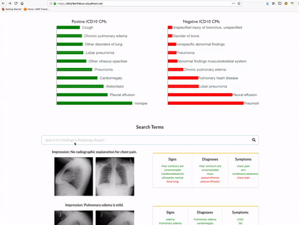

## Overview Architecture
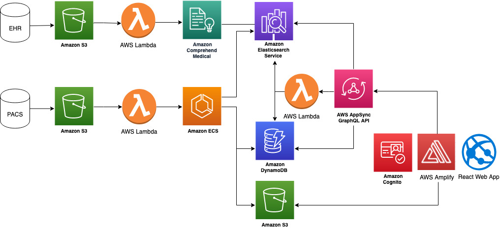

## Deployment Steps

### Step 1: Deploy Amplify React Web App
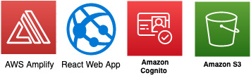

1. Install AWS Amplify CLI:  
`npm install -g @aws-amplify/cli@4.13.2`

2. [Install AWS Command Line Interface](https://docs.aws.amazon.com/cli/latest/userguide/install-cliv2.html) 

3. Configure AWS CLI: `aws configure --profile <profilename>` 

4. Clone this repository: `git clone https://github.com/aws-samples/medical-image-search.git`

5. Initialize AWS Amplify app: `cd medical-image-search && amplify init`

Answer the questions like:  
- Enter a name for the project **medical-image-search**  
- Enter a name for the environment **dev**  
- Choose your default editor: **Sublime Text**  
- Choose the type of app that you're building **javascript**  
Please tell us about your project:  
- What javascript framework are you using **react**  
- Source Directory Path:  **src**  
- Distribution Directory Path: **build**  
- Build Command:  npm run-script **build**  
- Start Command: npm run-script **start**  
- Do you want to use an AWS profile? **Yes** (Select the profile name your have configured earlier.) 

After execution, a new AWS Amplify App will be created with the name provided, e.g. medical-image-search.  

6. Adding Cognito authentication: `amplify add auth`

Answer the question like:
- Do you want to use the default authentication and security configuration? **Default configuration**  
- How do you want users to be able to sign in? **Username**  
- Do you want to configure advanced settings? **No, I am done.**  

7. Adding storage for medical image thumbnail files: `amplify add storage`

Answer the questions like:
- Please select from one of the below mentioned services: **Content (Images, audio, video, etc.)**  
- Please provide a friendly name for your resource that will be used to label this category in the project: **public**  
- Please provide bucket name: **medicalimagesearchpng**  
- Who should have access: **Auth users only**  
- What kind of access do you want for Authenticated users? **read** (press space for the selected option)  
- Do you want to add a Lambda Trigger for your S3 Bucket? **No**  

8. Deploy the CloudFormation (CFN) template configured above for authentication and storage: `amplify push`

You will see the following information:  
| Category | Resource name              | Operation | Provider plugin   |
| -------- | -------------------------- | --------- | ----------------- |
| Auth     | medicalimagesearchXXXXXXXX | Create    | awscloudformation |
| Storage  | public                     | Create    | awscloudformation |
  
confirm the deployment. After deployment finished, you will see the new cognito user pool and S3 bucket created, plus two nested CFN templetes: one for auth and another for storage. 

Take a note of the followings:
- Cognito User Pool ID as the Amplify Auth backend. 
- S3 bucket name as the Amplify Storage backend. 

Both of them can be found in the Output tab of the corresponding CFN nested stack deployment:  

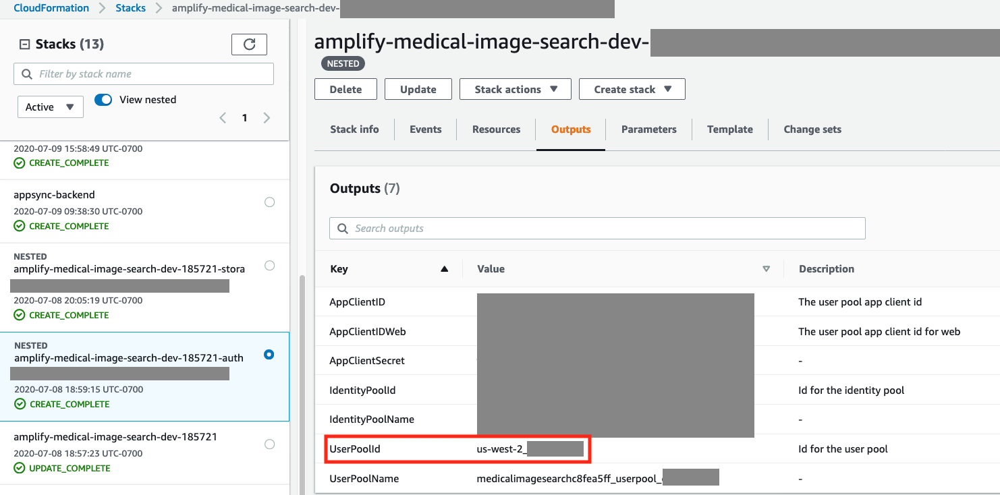
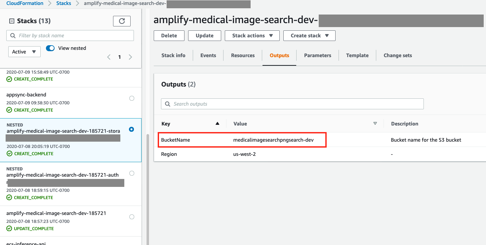=

### Step 2 Deploy the Image Featurization Container to AWS Fargate

1. [Install Docker engine](https://docs.docker.com/engine/install/)

2. Build docker container for image featurization processing: 

We use [SageMaker Inference Toolkit](https://github.com/aws/sagemaker-inference-toolkit) to serve the PyTorch inference model, which will convert a medical image in DICOM format into a feature vector with size of 1024.  
The following command can build the SageMaker Pytorch inference container and push it to Elastic Container Registry (ECR): 

`cd container/ && ./build_and_push.sh <profilename>`. 

Alternatively, go to the container folder and run script to build docker container: 

`docker build -t sagemaker-pytorch-inference:latest .`

and push docker image to repository, ECR or DockerHub manually. The repository image URI for docker container will be used to deploy Elastic Container Service (ECS) Fargate cluster. The ECR image and ECS cluster can be in different AWS regions.  

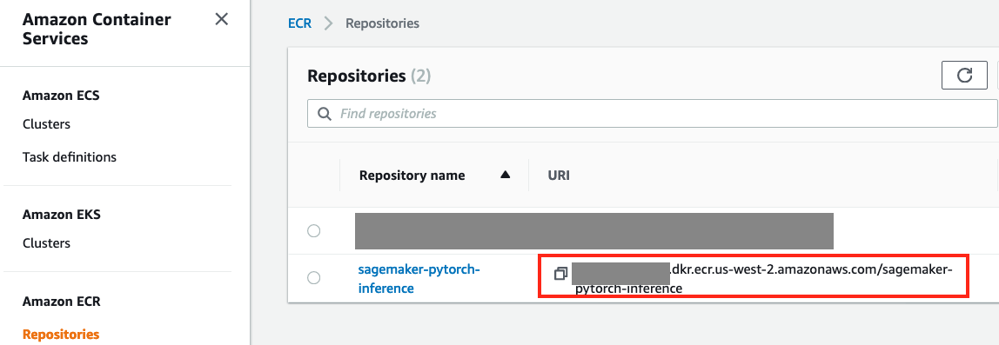

3. The inference toolkit is built on [Multi Model Server (MMS)](https://github.com/awslabs/multi-model-server): 

Follow the guide to [install MMS with pip](https://github.com/awslabs/multi-model-server#installing-multi-model-server-with-pip). Required steps are: 
- Prerequisites: make sure you have Java 8 SDK installed
- Step 1: install virtualenv and create a virtual environment
- Step3: install MMS `pip install multi-model-server`

4. Package MMS archive and upload to S3 bucket:

Once you have MMS command line tool installed and environment activated, go to MMS folder and wrap up your model package. If you have pre-trained a Pytorch inference model, place the model.pth file in this MMS folder before running the following package command:  

`model-archiver -f --model-name dicom_featurization_service --model-path ./ --handler dicom_featurization_service:handle --export-path ./`. 

Please follow the instruction on how to use [Model archiver for MMS](https://github.com/awslabs/multi-model-server/tree/master/model-archiver). 

Create a S3 bucket and upload the mar package file to that bucket with public read ACL, replacing the following placeholders: S3bucketname and profilename (allow the AWS user used in profile name to write to the bucket, the region can be different from ECR image region and CFN stack region):  

`aws s3 cp ./dicom_featurization_service.mar s3://<S3bucketname>/ --acl public-read --profile <profilename>`

5.  Deploy CFN template ecsfargate.yaml for ECS inference endpoint:

Override the following parameters in the CFN tempalte deployment:  
- ImageUrl: the image URI for MMS docker container uploaded in Elastic Container Registry (ECR) or DockerHub
- InferenceModelS3Location: the MMS package in S3

You can deploy using AWS CLI, go to CloudFormationTemplates folder, copy the following command, and replace the following placeholders: stackname, imageURI, S3bucketname, and profilename:  

`aws cloudformation deploy --capabilities CAPABILITY_IAM --template-file ./ecsfargate.yaml --stack-name <stackname> --parameter-overrides ImageUrl=<imageURI> InferenceModelS3Location=https://<S3bucketname>.s3.amazonaws.com/dicom_featurization_service.mar --profile <profilename>`

Or using 1-click deployment button:

Two required parameters for deployment are ImageURL (MMS Docker container in Amazon ECR) and InferenceModelS3Location (MMS package in S3 bucket). By default, the CFN stack will be deployed in us-east-1 region, feel free to change to other AWS regions on the AWS console, but the AWS region used here should be same as the React web application, which was deployed earlier using AWS Ampify CLI.

Once the CFN deployment finished, copy the InferenceAPIUrl from the Output tab:  
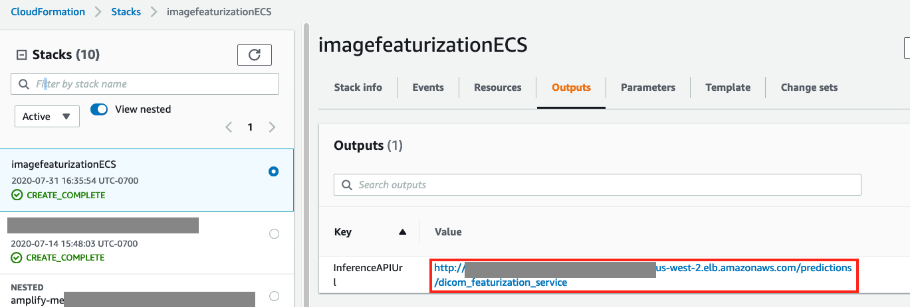

You can delete this CFN stack after the image featurization jobs are finished.

### Step 3. Deploy data processing pipeline and AWS AppSync API
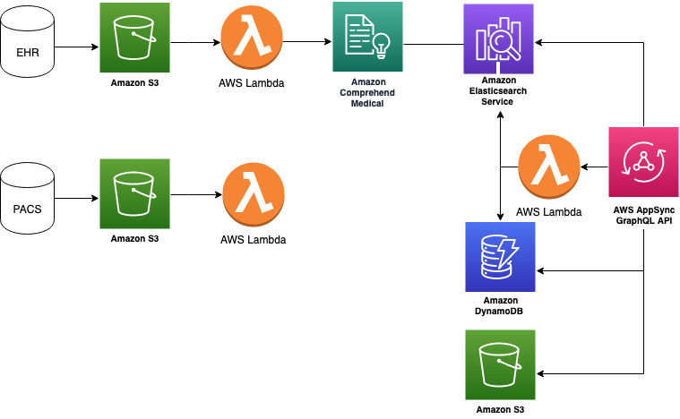

It is noteworthy that this stack should be deployed in the same AWS region as the AWS Amplify and AWS Fargate deployment mentioned above.

Once you have the following resources ready, you can deploy the AppSyncBackend.yaml CFN template.
- Inference API endpoint Url from Step 2.5 
- Cognito User Pool as AuthorizationUserPool from Step 1.8
- S3 bucket as PNGBucketName from Step 1.8

You can deploy using AWS CLI, go to CloudFormationTemplates folder, copy the following command, and replace the following placeholders: stackname, CFN_output_auth, CFN_output_storage, inferenceAPIUrl, and profilename:  

`aws cloudformation deploy --capabilities CAPABILITY_NAMED_IAM --template-file ./AppSyncBackend.yaml --stack-name <stackname> --parameter-overrides AuthorizationUserPool=<CFN_output_auth> PNGBucketName=<CFN_output_storage> InferenceEndpointURL=<inferenceAPIUrl> --profile <profilename>`   

Or using 1-click deployment button:

Three required parameters for deployment are AuthorizationUserPool, InferenceEndpointURL, and PNGBucketName.

The [Lambda function](https://medical-image-search-us-east-1.s3.amazonaws.com/lambda.zip) for medical image processing, plus [its dependency layer](https://medical-image-search-us-east-1.s3.amazonaws.com/python.zip) can be downloaded separately as well. The dependency layer includes the following libraries: boto3-1.12.12, botocore-1.15.12, certifi-2019.11.28, chardet-3.0.4, docutils-0.15.2, elasticsearch-7.5.1, idna-2.8, jmespath-0.9.5, python_dateutil-2.8.1, requests-2.22.0, requests_aws4auth-0.9, s3transfer-0.3.3, six-1.14.0, urllib3-1.25.8.   

Take a note of the AWS AppSync API URL and AWS Region from AWS AppSync console:  
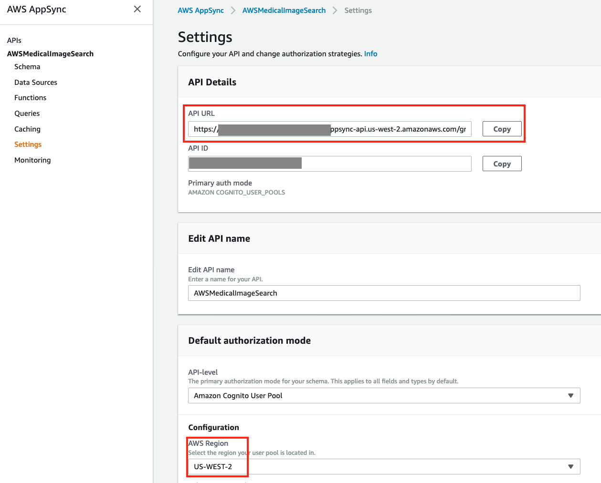

the same AWS AppSync API endpoint is available in CFN stack Outputs tab:
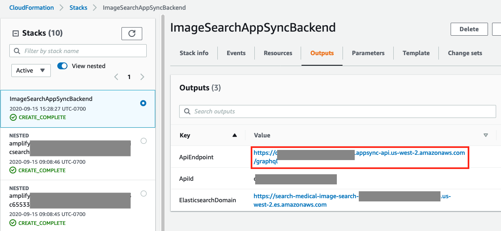

Edit and copy the following in `src/aws-exports.js` file in your working home folder, replace the placeholders with values aforementioned:  

`const awsmobile = {  
    "aws_appsync_graphqlEndpoint": "<AppSync API URL>",  
    "aws_appsync_region": "<AWS AppSync Region>",  
    "aws_appsync_authenticationType": "AMAZON_COGNITO_USER_POOLS"   
};`. 

Once this CFN stack is successfully deployed, you can download MIMIC CXR data set and upload DICOM files to S3 bucket mimic-cxr-dicom- and free text radiology report to S3 bucket mimic-cxr-report- to trigger the transformation jobs. Then you should see the new records created in DynamoDB table medical-image-metadata and ElasticSearch domain medical-image-search. You will need to obtain access from PhysioNet first.

Finally, you can test the Amplify React Web application locally, by running commands:  

`npm install && npm start`    

Or you can publish the react web app by deploying it in S3 with CloudFront distribution:  

`amplify hosting add`. 

Answer the questions like:
- Select the environment setup: **DEV (S3 only with HTTP)**
- hosting bucket name** medical-image-search-XXXXXXXXXXX-hostingbucket**
- index doc for the website **index.html**
- error doc for the website **index.html**

then `amplify publish`

| Category | Resource name              | Operation | Provider plugin   |
| -------- | -------------------------- | --------- | ----------------- |
| Hosting  | S3AndCloudFront            | Create    | awscloudformation |
| Auth     | medicalimagesearchXXXXXXXX | No Change | awscloudformation |
| Storage  | medicalimages              | No Change | awscloudformation |

You will see the Hosting endpoint after deployment. 
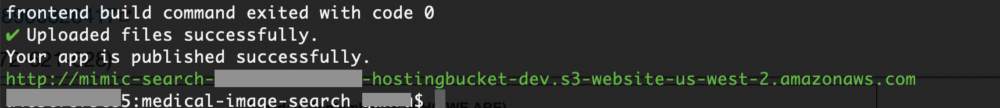

Congratulations! You have a medical image search platform ready to use. You download the open data set, e.g. [MIMIC CXR](https://physionet.org/content/mimic-cxr/2.0.0/), or use your own medical images: uploading DICOM images to S3 bucket mimic-cxr-dicom-<AccountID> and free text clinical report to S3 bucket mimic-cxr-report-<AccountID>. Then you will be able search and query them using the react web app.

## License

This library is licensed under the MIT-0 License. See the LICENSE file.
